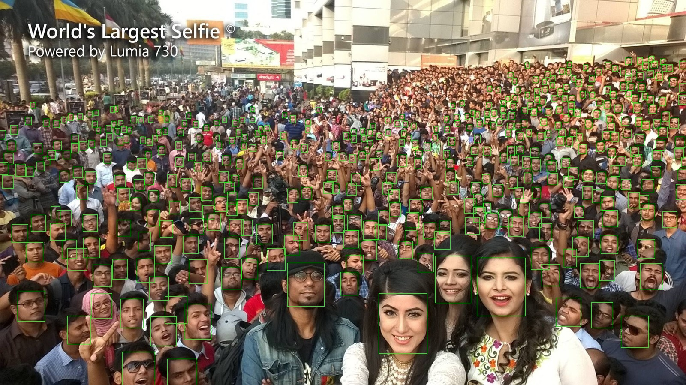

# Retinaface with TensorRT support

## Pre-requirement
* TensorRT
* CUDA
* PyCUDA
* Mxnet with TensorRT support
## Installation
* Install PyCUDA
```
sudo apt-get install build-essential python-dev python-setuptools libboost-python-dev libboost-thread-dev -y
sudo apt-get install python-numpy python3-numpy -y
sudo apt-get install libboost-all-dev
git clone --recursive --branch v2020.1 https://github.com/inducer/pycuda.git
cd pycuda
python configure.py --cuda-root=/usr/local/cuda-10.2
pip install -e .
```
* Install some python packages
```
pip install opencv-python insightface nvidia-pyindex geventhttpclient tritonclient onnx onnxruntime 
pip install tensorrt-7.2.2.3-cp36-none-linux_x86_64.whl
```
## Run build Retinaface-TensorRT with single-inference
* Without FP16
```
    python3 build_detectors.py --im_width 1600 --im_height 898
```
* With FP16
```
    python3 build_detectors.py --im_width 1600 --im_height 898 --fp16
```
## Run build Retinaface-TensorRT with batch-inference
* Step 1: Convert to ONNX: download model weights at: https://github.com/deepinsight/insightface
```
    python3 sample_retinaface_to_onnx.py \
                    --model_symbol R50-symbol.json \
                    --model_params R50-0000.params \
                    --batch_size 4 \
                    --im_width 640 \
                    --im_height 640 \
                    --onnx_path retinaface_r50_v1-640x640-batchsize_4.onnx
```
* Step 2: Convert ONNX to TensorRT with FP16
```
    /usr/src/tensorrt/bin/trtexec \
                    --onnx=retinaface_r50_v1-640x640-batchsize_4.onnx \
                    --saveEngine=retinaface_r50_v1-640x640-batchsize_4.trt \
                    --verbose \
                    --fp16
```
* Step 3: Test converted model
```
    python3 sample_retinaface_to_trt.py
                    --model_path retinaface_r50_v1-640x640-batchsize_4.trt\
                    --batch_size 4 \
                    --im_width 640 \
                    --im_height 640 \
```
Note: Batch and image size is fixed for TensorRT
## Performance
Resolution | Baseline | TensorRT-FP32 (batchsize=1) | TensorRT-FP16 (batchsize=1) | Speed Up 
--- | --- | --- | --- |--- 
1280x1280 | 18.7 | 22.2 | 28.1 | 1.50x 
640x640 | 57.1 | 71.1 | 131.1 | 2.30x 
512x512 | 75.4 | 109.2 | 191.8 | 2.54x 
512x256 | 80.0 | 127.6 | 212.6 | 2.66x 
## Reference
[1] https://github.com/deepinsight/insightface <br>
[2] https://github.com/SthPhoenix/InsightFace-REST
